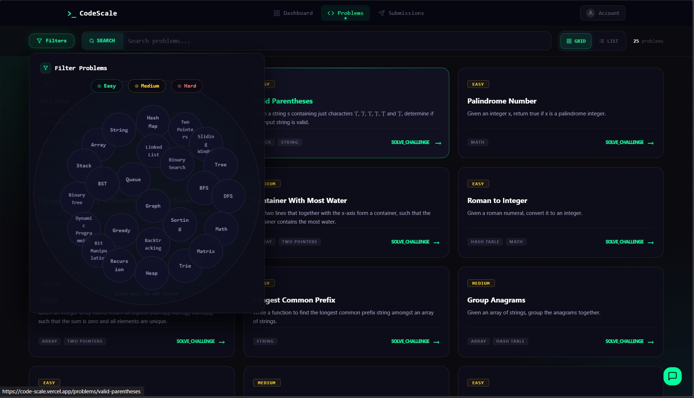
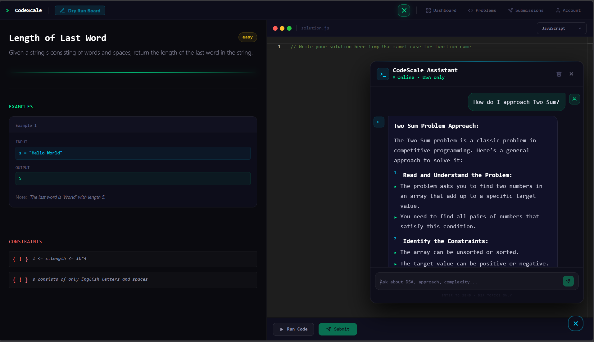
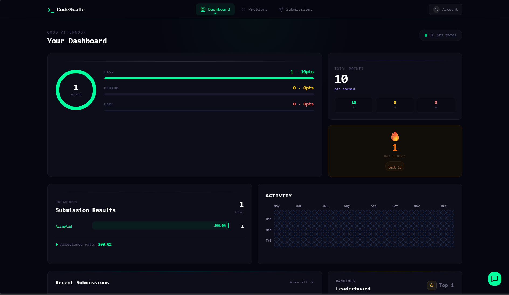
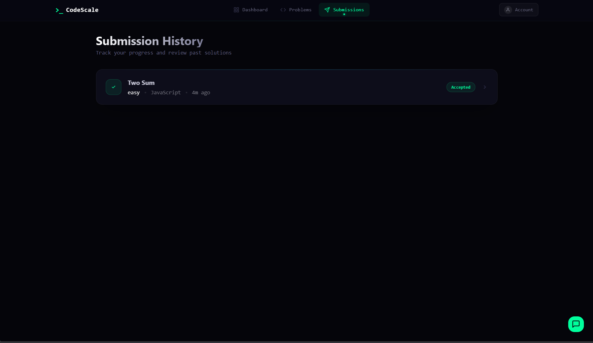
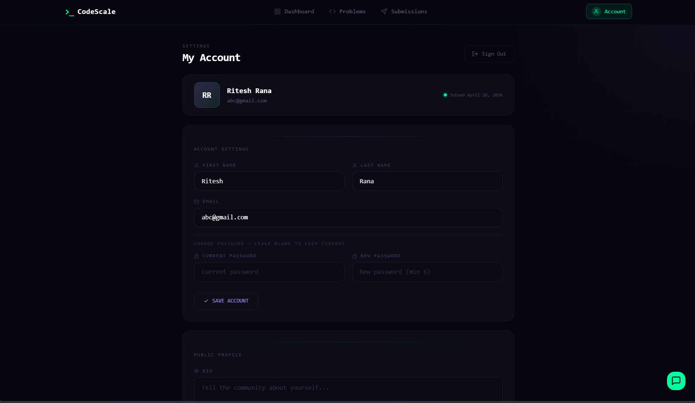

<div align="center">

<!-- ANIMATED HEADER -->


<br/>

[](https://code-scale.vercel.app)
[](https://vercel.com)
[](https://render.com)
[](./LICENSE)

<br/>


</div>

---

## 📸 Screenshots

|              Home Page               |                Problems List                 |               Code Editor                |
| :----------------------------------: | :------------------------------------------: | :--------------------------------------: |
|  |  |  |

|                   Dashboard                    |                    Submissions                     |                  Account                   |
| :--------------------------------------------: | :------------------------------------------------: | :----------------------------------------: |
|  |  |  |

---

## 🚀 What is CodeScale?

**CodeScale** is a full-stack, focused coding judge platform built for developers who want to sharpen their **Data Structures & Algorithms** skills. Think of it as a self-hosted, lightweight LeetCode — with a built-in AI assistant, a dry-run canvas, real code execution, and a beautiful dashboard to track your growth.

The platform currently supports **JavaScript** and **Python**, with **30 curated problems** spanning Easy, Medium, and Hard difficulty levels.

---

## ✨ Key Features


| Feature                     | Description                                                                                                                   |
| --------------------------- | ----------------------------------------------------------------------------------------------------------------------------- |
| 🧩 **Problem Library**      | 30 problems (10 Easy / 10 Medium / 10 Hard) with topic filters like Arrays, Trees, DP, Graphs and more                        |
| ⚡ **Live Code Execution**  | Write JavaScript or Python in a Monaco editor and run code with real test cases, getting instant verdicts                     |
| 🤖 **AI Chatbot Assistant** | Built-in DSA-only AI (powered by Groq) that guides you on approach, complexity, and strategy — without giving away the answer |
| 🖊️ **Dry Run Canvas**       | A freehand drawing canvas to sketch arrays, trees, or graphs before writing a single line of code                             |
| 📊 **User Dashboard**       | Points, streaks, activity heatmap, submission breakdown, and a leaderboard — all in one place                                 |
| 📜 **Submission History**   | Full history of every accepted/rejected submission with source code review                                                    |
| 🔐 **Auth System**          | JWT-based authentication with secure cookie storage, bcrypt password hashing, and Zod validation                              |
| 👤 **Account Management**   | Update name, email, password, and public bio from your account settings page                                                  |
| 🛡️ **Admin Panel**          | Protected admin routes to manage problems and platform analytics                                                              |
| 🏆 **Leaderboard**          | Global rankings by total points earned across all accepted problems                                                           |

---

## 🗂️ Folder Structure

```
CodeScale/
├── 📁 backend/
│   ├── 📁 config/
│   │   ├── db.js                    # MongoDB connection
│   │   ├── .env                     # Environment variables
│   │   └── .env.example             # Env template
│   │
│   ├── 📁 controllers/
│   │   ├── auth.controller.js        # Sign up / Sign in / Sign out
│   │   ├── user.controller.js        # Profile & account updates
│   │   ├── problems.controller.js    # Fetch problems & details
│   │   ├── user_submission.controller.js  # Run & submit code
│   │   ├── user_history.controller.js     # Submission history
│   │   ├── submissionDetail.controller.js # Single submission detail
│   │   ├── user_analytics.controller.js   # Dashboard stats & heatmap
│   │   ├── chatbot.controller.js     # Groq AI chatbot integration
│   │   ├── admin.controller.js       # Admin problem management
│   │   └── plateform_analytics.controller.js # Platform-wide stats
│   │
│   ├── 📁 middleware/
│   │   ├── auth.middleware.js        # JWT verification
│   │   └── admin.middleware.js       # Admin role guard
│   │
│   ├── 📁 models/
│   │   ├── user.model.js             # User schema (name, email, stats)
│   │   ├── problems.model.js         # Problem schema (title, difficulty, tags)
│   │   ├── submission.model.js       # Submission schema (code, verdict)
│   │   └── avatar/                  # Default avatar assets
│   │
│   ├── 📁 routes/
│   │   ├── auth.route.js
│   │   ├── problems.route.js
│   │   ├── user.route.js
│   │   ├── user_submission.route.js
│   │   ├── user_history.route.js
│   │   ├── user_analytics.route.js
│   │   ├── chatbot.route.js
│   │   └── admin.route.js
│   │
│   ├── 📁 services/
│   │   └── executionEngine.js       # Code execution sandbox (JS & Python)
│   │
│   ├── 📁 utils/
│   │   ├── template.js              # Language code templates
│   │   └── user_statsHelper.js      # Points & streak calculation
│   │
│   ├── 📁 temp/                     # Temp files for code execution (auto-cleaned)
│   └── server.js                    # Express app entry point
│
├── 📁 frontend/
│   ├── 📁 src/
│   │   ├── 📁 api/
│   │   │   └── api.js               # Axios base instance
│   │   │
│   │   ├── 📁 components/
│   │   │   ├── 📁 codeEditor/
│   │   │   │   ├── CodeEditor.jsx         # Monaco editor wrapper
│   │   │   │   ├── DryRunCanvas.jsx       # Freehand drawing canvas
│   │   │   │   ├── ProblemDescription.jsx # Problem sidebar
│   │   │   │   ├── Language.jsx           # Language switcher
│   │   │   │   ├── RunCodeButton.jsx
│   │   │   │   └── SubmitButton.jsx
│   │   │   │
│   │   │   ├── 📁 chatbot/
│   │   │   │   └── Chatbot.jsx            # AI assistant panel
│   │   │   │
│   │   │   ├── 📁 charts/
│   │   │   │   ├── StatsOverview.jsx      # Points & difficulty breakdown
│   │   │   │   ├── SubmissionChart.jsx    # Submission result chart
│   │   │   │   └── DashboardSkeleton.jsx  # Loading skeleton
│   │   │   │
│   │   │   ├── ActivityMap.jsx            # GitHub-style activity heatmap
│   │   │   ├── FilterProblem.jsx          # Tag/difficulty filter UI
│   │   │   ├── Leaderboard.jsx            # Rankings widget
│   │   │   ├── RecentSubmission.jsx       # Recent activity feed
│   │   │   ├── Navbar.jsx
│   │   │   └── HamburgerMenu.jsx
│   │   │
│   │   ├── 📁 pages/
│   │   │   ├── HomePage.jsx               # Landing page
│   │   │   ├── ProblemsList.jsx           # All problems grid/list view
│   │   │   ├── ProblemPage.jsx            # Individual problem + editor
│   │   │   ├── SubmissionHistory.jsx      # Full submission log
│   │   │   ├── SubmissionDetail.jsx       # Single submission view
│   │   │   ├── 📁 auth/
│   │   │   │   ├── SignIn.jsx
│   │   │   │   └── SignUp.jsx
│   │   │   └── 📁 user/
│   │   │       ├── UserDashboard.jsx      # Personal stats dashboard
│   │   │       └── MyAccount.jsx          # Account settings
│   │   │
│   │   ├── 📁 hooks/
│   │   │   ├── signIn.js
│   │   │   ├── signUp.js
│   │   │   └── useChatBot.js
│   │   │
│   │   ├── 📁 services/
│   │   │   ├── heatMap.js             # Heatmap data formatter
│   │   │   ├── signIn.service.js
│   │   │   └── signUp.service.js
│   │   │
│   │   ├── 📁 context/
│   │   │   └── ProblemContext.jsx     # Problem state context
│   │   │
│   │   ├── App.jsx
│   │   ├── AppLayout.jsx
│   │   └── main.jsx
│   │
│   ├── index.html
│   ├── vite.config.js
│   └── package.json
│
├── LICENSE
└── README.md
```

---

## 🛠️ Tech Stack

### Frontend

| Technology                                                                                                             | Purpose                     |
| ---------------------------------------------------------------------------------------------------------------------- | --------------------------- |
|                           | UI framework                |
|                                | Build tool & dev server     |
|          | Utility-first styling       |
|        | Client-side routing         |
|              | Animations & transitions    |
|  | VS Code-quality code editor |
|                                    | Dry run drawing canvas      |
|                               | HTTP client                 |

### Backend

| Technology                                                                                         | Purpose                    |
| -------------------------------------------------------------------------------------------------- | -------------------------- |
|   | REST API framework         |
|   | Server runtime             |
|     | Database                   |
|  | ODM for MongoDB            |
|       | Authentication tokens      |
|                                    | Password hashing           |
|                                          | Input validation           |
|                                 | AI chatbot (DSA assistant) |
|     | Dev auto-restart           |

### Deployment

| Service                                                                                      | Role             |
| -------------------------------------------------------------------------------------------- | ---------------- |
|  | Frontend hosting |
|  | Backend hosting  |

---

## 🔌 API Overview

```
/api/v1/auth        → Sign up, Sign in, Sign out
/api/v1/problems    → Get all problems, get problem by ID
/api/v1/submission  → Run code, submit solution
/api/v1/user        → Profile, account update, submission history
/api/v1/analytics   → Dashboard stats, activity heatmap, leaderboard
/api/v1/chatbot     → AI DSA assistant (Groq-powered)
/api/v1/admin       → Admin problem management & platform analytics
```

---

## 🏁 Getting Started Locally

### Prerequisites

- Node.js v18+
- MongoDB (local or Atlas)
- A [Groq API key](https://console.groq.com)

### 1. Clone the repo

```bash
git clone https://github.com/riteshrana12-dev/codeScale.git
cd CodeScale
```

### 2. Setup Backend

```bash
cd backend
cp config/.env.example config/.env
# Fill in your MongoDB URI, JWT secret, and Groq API key in config/.env
npm install
npm run dev
```

### 3. Setup Frontend

```bash
cd ../frontend
# Create .env with your backend URL
echo "VITE_API_URL=http://localhost:3000" > .env
npm install
npm run dev
```

### 4. Open in browser

```
Frontend → http://localhost:5173
Backend  → http://localhost:3000
```

---

## 🌐 Live Deployment

|                    | URL                                                            |
| ------------------ | -------------------------------------------------------------- |
| 🖥️ **Frontend**    | [https://code-scale.vercel.app](https://code-scale.vercel.app) |
| ⚙️ **Backend API** | Hosted on Render (connected internally)                        |

---

## 📄 License

This project is licensed under the **ISC License** — see the [LICENSE](./LICENSE) file for details.

---

<div align="center">


<br/>

⭐ **If you found this project helpful, consider giving it a star!** ⭐

# </div>
